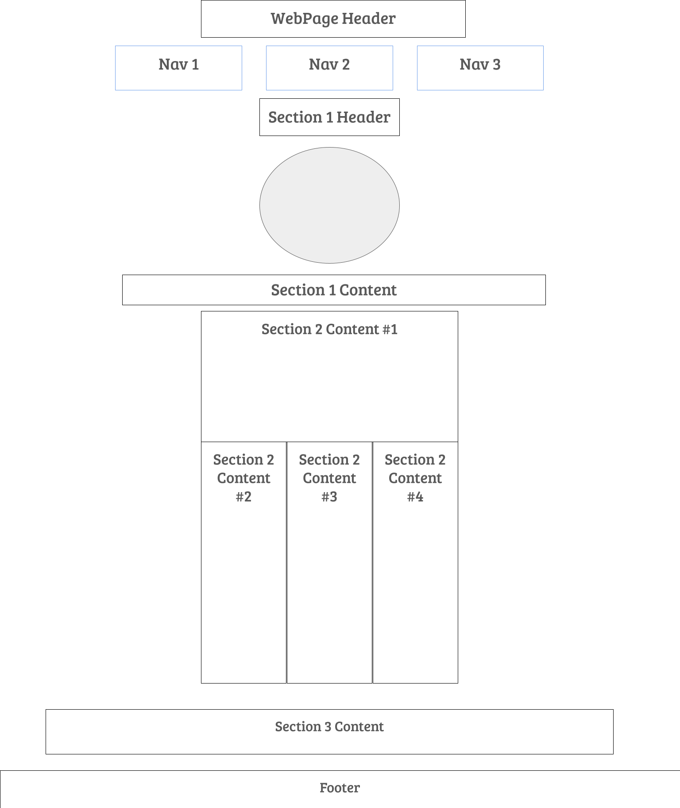

# professional-portfolio

## Overview
It is crucial to have a deployed professiional portfolio in order to showcase my applications and projects to future employers. Using my current skills in HTML and CSS, I have created and deployed a live webpage that both showcases my website development skills, but also showcases my projects to employers.

## Features
The codebase has an abundance of features as stated below:
- Uses flexbox elements to obtain a fully responsive webpage, compatible with a large range of screen dimensions
- Has subtle transitions when the user interacts with the buttons on screen
- Clicking any of the three options in the navigation bar will direct the user to the corrosponding section of the webpage
- Contains "alt" phrases with descriptive titles of each image displayed, for screen readers 

## Usage

Link to working website: [Github Pages](https://trishaneww.github.io/professional-portfolio/)

## WireFrame

## Credits

Trishane Wijeyawickrema

Link to [Github Repository](https://github.com/Trishaneww/professional-portfolio)

## Liscence

